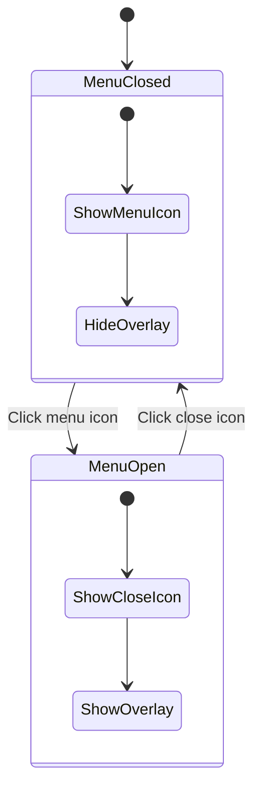

#Mobile Menu Toggle Implementation

## Approach

Use **minimal React state** (single boolean) combined with **CSS classes** for all visual transitions. This keeps JS minimal while leveraging CSS for smooth animations and layout control.

## Implementation Steps

### 1. Update MainNav Component ([components/main-nav.tsx](components/main-nav.tsx))

**Add state management:**

- Import `useState` from React
- Add `const [isMenuOpen, setIsMenuOpen] = useState(false)`
- Create toggle handler: `const toggleMenu = () => setIsMenuOpen(!isMenuOpen)`

**Update menu/close button:**

- Combine `menuItem()` and `closeItem()` into single clickable button
- Conditionally render MenuIcon or CloseIcon based on `isMenuOpen`
- Attach `onClick={toggleMenu}` handler
- Add `cursor-pointer` for UX

**Add mobile menu overlay:**

- Add `relative` class to the `<nav>` element (makes it the positioning context)
- Create overlay as a child of nav using absolute positioning
- Conditionally show/hide using CSS classes based on `isMenuOpen`
- Structure:
  ```javascript
        <nav className="... relative">
          {/* existing nav content */}
          <div className={mobile overlay classes}>
            {/* Mobile navigation links here */}
          </div>
        </nav>
  ```


### 2. Style the Overlay with Tailwind CSS

**Overlay classes:**

- `absolute left-0 right-0` - full width, positioned relative to nav
- `top-full` - position directly below the nav (no calc needed!)
- `h-screen` - full viewport height
- `bg-white` - solid white background
- `z-40` - ensure it overlays content
- `lg:hidden` - hide on desktop
- Conditional: `hidden` when closed, `block` when open
- Optional: Add `transition-opacity duration-300` for fade effect

### 3. Add Mobile Navigation Links

Inside the overlay, render:

- Main navigation items (Projets, Infos, Contact)
- Sub-navigation items when applicable
- Style appropriately for mobile (larger touch targets, spacing)

## CSS-First Benefits

- All animations handled by Tailwind transition classes
- No complex JS animation logic
- Single boolean state is React-idiomatic
- Smooth, performant transitions
- Easy to maintain and extend

## Visual Flow

